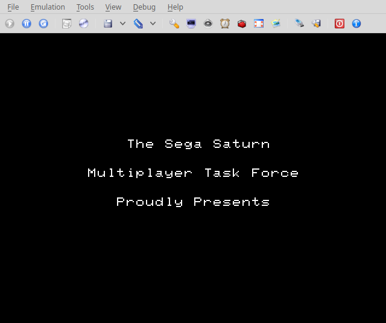
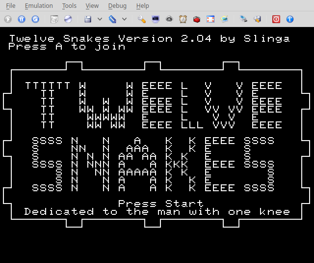
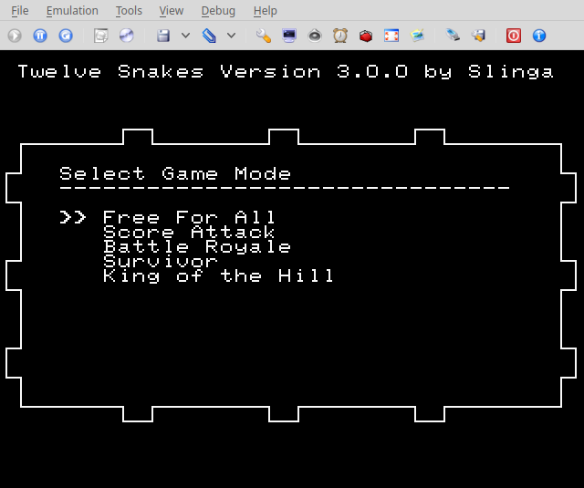
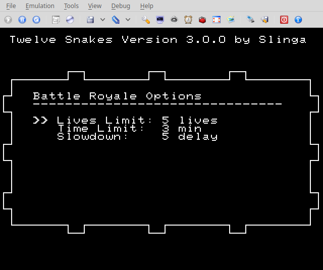
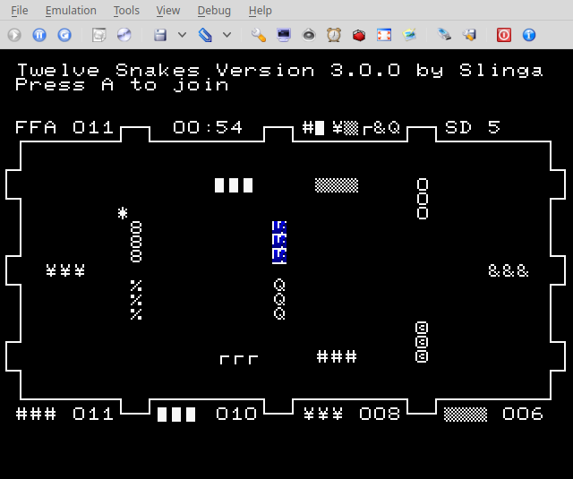
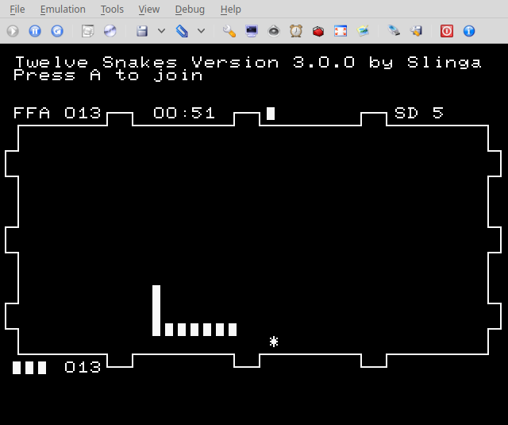
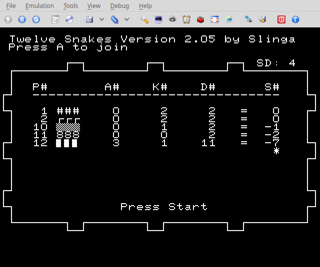

## Twelve Snakes
Twelve Snakes is a 12-player text-mode Snake clone for the Sega Saturn. Requires two [6 Player Adaptors](https://segaretro.org/Saturn_6_Player_Adaptor) for full twelve player support. Requires a modded Saturn or another method to get code running on actual hardware. Build the code with joengine or grab an ISO from [releases](https://github.com/slinga-homebrew/Twelve-Snakes/releases).

The resolution of the game has been changed to support wide screen televisions:
- Use the zoom feature (not 16:9) in your television
- The top text and the bottom empty space will be cut off but the game area will take up the entire TV
- The aspect ratio looks correct

## Screenshots

### Player One Special Commands
Only player one can:
- pause/display the score with the Start button
- speedup/slowdown the game with the Left and Right Shoulder buttons
- clear scores with the Z button
- press ABC+Start to reset the game

### Game Modes
#### Free For All
No victory condition, just keep playing to score more points. A good way to test out the game. Press start on player one's controller to see the score. 
#### Score Attack
Game ends when time runs out or one of the players reaches the score limit. 
#### Battle Royale
Game ends when there is only one player left standing. Requires multiple players. 
#### Survivor
Game ends when time runs out. The winner is the longest current snake.
#### King of the Hill
Game ends when time runs out. The winner is the longest snake that ever existing. 

### HUD Display
The top left area has the game mode and a variable number that changes based on the game mode. On most game mode it is the score of the winningest player. In Battle Royale it is the number of lives left. The second area is the a timer that counts down until the game ends (or enters sudden death for Battle Royale). In Free For All the counter counts up. The 3rd area represents the ordering of the top 1-7 players. The 4th area is the current slowdown of the game. The higher slowdown the slower the game plays. 

The bottom hud area lists the top four players and their current scores. 

### Score
When player one hit starts, the score is displayed. The fields mean the following:

### R#
The player's rank among the other players. Can be 1-12. 
### CHR
The snake
### L#
Current length of the snake
### M#
Maximum length of the snake ever
### A#
Number of apples eaten by the snake
### K#
Number of times the snake has killed another player
### C#
Number of times the snake has eaten another snake. This requires a head-on collision of two snakes and one snake must be at least 2x as big as the other. Eating another snake increases the player's length by the length of the consumed snake. 
### D#
Number of times the snake has died
### S#
Current score. Varies based on game-mode. 

## Issues
No known issues

## Building
Requires joengine to build. Checkout source code folder to your joengine "Samples" directory and run "./compile.sh". 

## Credits
[Segaxtreme](http://www.segaxtreme.net/) - The best Sega Saturn development forum on the web. Thank you for all the advice from all the great posters on the forum.  
[Sega Saturn Multiplayer Task Force](http://vieille.merde.free.fr/) - Other great Sega Saturn games with source code  
[joengine](https://github.com/johannes-fetz/joengine) - Sega Saturn dev environment  
