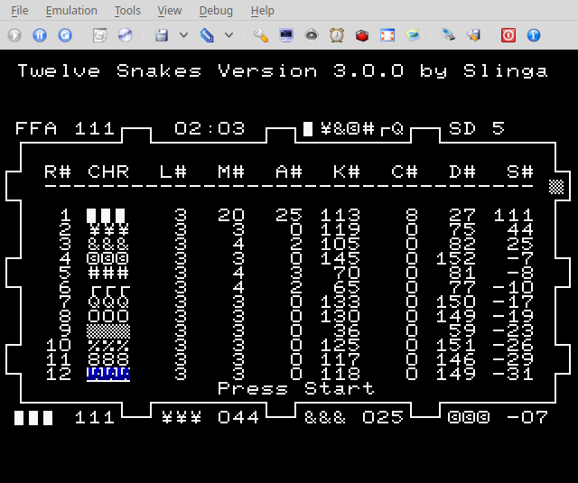

## Twelve Snakes
Twelve Snakes is a 12-player text-mode Snake clone for the Sega Saturn. Requires a modded Saturn or another method to get code running. Build the code with joengine or grab an ISO from [releases](https://github.com/slinga-homebrew/Twelve-Snakes/releases).

The resolution of the game has been changed to support wide screen televisions:
- Use the zoom feature (not 16:9) in your television
- The top text and the bottom empty space will be cut off but the game area will take up the entire TV
- The aspect ratio looks correct

### Player One Special Commands
Only player one can:
- pause/display the score with the Start button
- speedup/slowdown the game with the Left and Right Shoulder buttons
- clear scores with the Z button

## Screenshots

## Issues
No known issues

## Building
Requires joengine to build. Checkout source code folder to your joengine "Samples" directory and run "./compile.sh". 

## Credits
[Segaxtreme](http://www.segaxtreme.net/) - The best Sega Saturn development forum on the web. Thank you for all the advice from all the great posters on the forum.  
[Sega Saturn Multiplayer Task Force](http://vieille.merde.free.fr/) - Other great Sega Saturn games with source code  
[joengine](https://github.com/johannes-fetz/joengine) - Sega Saturn dev environment  
